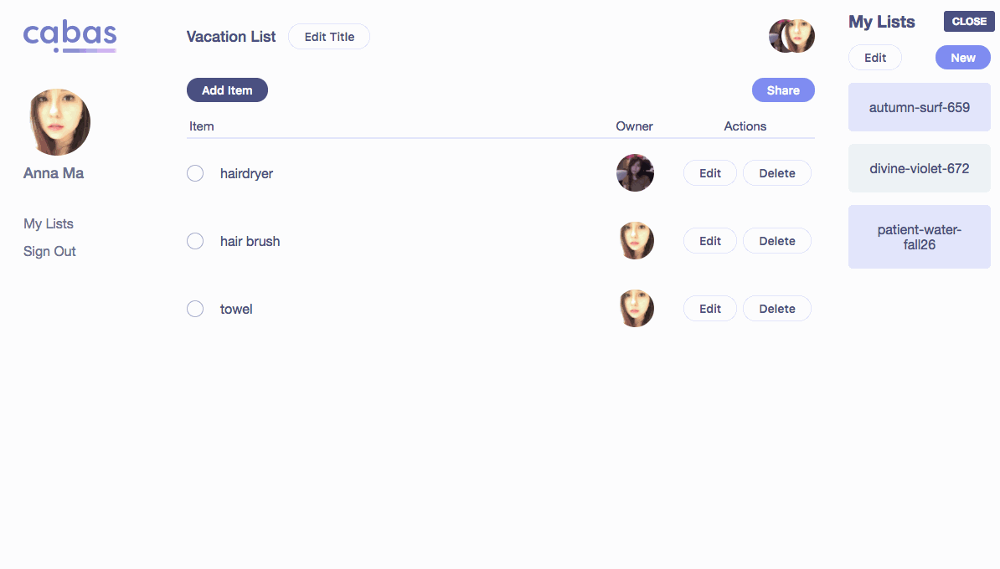

# cabas🎍
Real-time collaborative list web app 🔥
[Check it out!](https://cabas-a8b4a.firebaseapp.com/ "Official site")

This repo builds the react web-app for cabas. 

It's built using:

- [React](https://github.com/facebook/react) - UI and view.
- [Firebase](http://firebase.com) - Database and authentication.
- [re-base](https://github.com/tylermcginnis/re-base) - Synchronize data between React and Firebase.



## Install and run
- Configure the base_config.js file with your Firebase configuration.
- Rename base_config.js to base.js
``` bash
# Install packages
$ npm install

# Run on localhost
$ npm start
```

## Build for production
``` bash
# Build minified React app
$ npm run build
```

## Roadmap
- Mobile responsiveness
- Sharing list by email
- Redux state management

## Contributions, issues, requests
If you would like to contribute, have an issue, or got a request for a feature, please [open a new issue here](https://github.com/annuhdo/cabas/issues/new)
